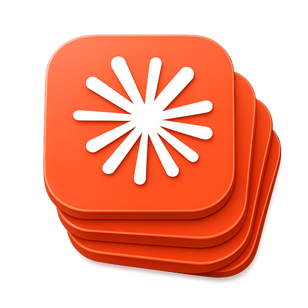
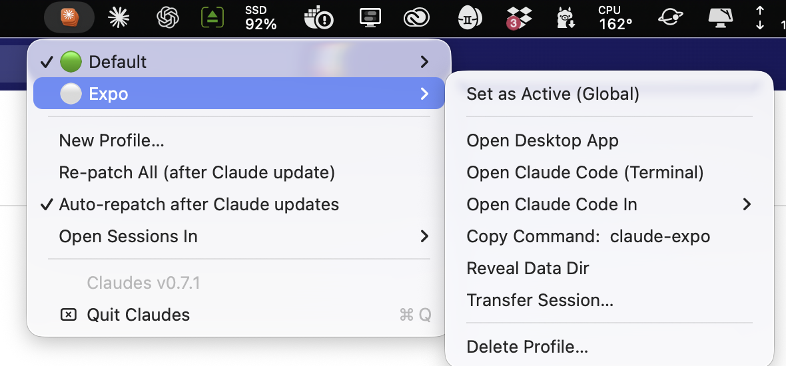

<p align="center">
  
</p>

<h1 align="center">Claudes</h1>

<p align="center">
  <strong>Run multiple isolated Claude accounts on one Mac.</strong><br>
  Work · personal · client — each with its own dock icon, login, and Claude Code config.<br>
  A menu bar app plus a small CLI. Roll-your-own Multi-Claude.
</p>

<p align="center">
  <a href="https://github.com/noisyneighborstudio/claudes/releases/latest"></a>
  
  <a href="#license"></a>
</p>

<p align="center">
  <a href="#install"><b>Install</b></a> ·
  <a href="#everyday-use">Everyday use</a> ·
  <a href="#sessions--rotation">Sessions</a> ·
  <a href="#the-claudes-cli">CLI</a> ·
  <a href="#the-menu-bar-app">Menu bar app</a> ·
  <a href="#troubleshooting">Troubleshooting</a>
</p>

<br>

<p align="center">
  
</p>

<br>

## Install

```sh
curl -fsSL https://raw.githubusercontent.com/noisyneighborstudio/claudes/main/install.sh | zsh
```

<details>
<summary>Prefer to read before you pipe?</summary>

```sh
git clone https://github.com/noisyneighborstudio/claudes && cd claudes
./install.sh
```

</details>

The installer prefers the signed release and falls back to building from source (prompting for Xcode Command Line Tools if missing). It puts `claudes` and the per-profile commands on your `PATH`, and adds tab completion for **zsh**, **bash**, and **fish** — whichever you have.

Then:

1. Menu bar → **Claudes icon** → **New Profile…** → e.g. `Work`
2. Sign in once in the new desktop app, and once in the CLI (`/login`)
3. Optional — add `Claudes.app` to **System Settings → Login Items**

> [!TIP]
> `./uninstall.sh` reverses all of it. Add `--purge` to also remove profiles.

<br>

## What a profile is

One **profile** = one cloned desktop app + one isolated CLI config.

|             | Lives at                          | Isolated via        |
| ----------- | --------------------------------- | ------------------- |
| **Desktop** | `/Applications/Claude-<Name>.app` | `--user-data-dir`   |
| **CLI**     | `~/.claude-profiles/<Name>`       | `CLAUDE_CONFIG_DIR` |

Logins live outside the app bundle, so they survive every rebuild.

<br>

## Everyday use

Every profile gets a command named after it:

```sh
claude-expo               # Claude Code with the Expo profile
claude-as Expo --resume   # same, explicit + tab-completable
claudes run Expo          # what both of the above call
```

These are real executables on `PATH` (symlinks next to `claudes`), not shell functions — so editors, GUI apps, `Makefile`s, cron jobs and non-interactive shells can use them too, with no rc file sourced. `claudes new`/`delete` keep them in sync; `claudes shims` re-syncs by hand. A name that already exists as a real binary is never overwritten.

> [!TIP]
> **Per-project auto-switching.** Put `export CLAUDE_CONFIG_DIR=$HOME/.claude-profiles/Work` in a repo's `.envrc` (direnv).

<br>

## Sessions & rotation

Sessions belong to a profile, but they don't have to stay there. Claudes can list them, move them between profiles, and rotate new work across your accounts — handy when one account hits its usage limit mid-task.

```sh
claudes sessions                    # id · date · project · first prompt
claudes transfer <id> --to Work     # move a session (transcript + todos + env)
claudes transfer <id> --next        # …or to the next profile in rotation
claudes run --next                  # new session on the next profile
claudes desktop --next              # next profile's desktop app
```

Rotation is blind; `--best` is not. It asks each account's **server-side usage
data** (the same numbers the CLI's `/usage` screen shows — all devices and
surfaces included) and picks the profile with the most 5-hour-window headroom:

```sh
claudes best                        # per-profile usage: 5h% · 7d% · resets
claudes run --best                  # new session on the emptiest account
```

And the one-liner for *keep going on another account*:

```sh
claudes run --best --start-from-session=<id>    # (or --next for blind rotation)
```

That finds the session wherever it lives, moves it to the best (or next)
profile — never the one it's already on — jumps to the session's project
directory, and resumes it there — same conversation, different account.

Rotation is round-robin over all profiles, `Default` included. One shared pointer: `run`, `desktop`, and `transfer` advance it together. Transfers are also in the tray — each profile's menu has **Transfer Session…** with a session picker and a one-click **Open Now** after the move.

<br>

## The `claudes` CLI

Everything the tray does is also a command — the tray shells out to the same script, so the two can't drift.

| Command                          | What it does                                                                 |
| -------------------------------- | ---------------------------------------------------------------------------- |
| `claudes list`                   | Profiles: ✓ active, 🟢 running                                                |
| `claudes use <Profile>`          | Switch the **global** active profile                                         |
| `claudes run <Profile\|--next\|--best>` | New session — pinned, rotating, or emptiest account; `--start-from-session=<id>` moves + resumes |
| `claudes best`                   | Per-profile server-side usage (5h/7d windows)                                |
| `claudes sessions [Profile]`     | List sessions (id · date · project · prompt)                                 |
| `claudes transfer <id> --to <P>` | Move a session between profiles (`--next`/`--best` pick for you)             |
| `claudes new <Name>`             | Create a profile                                                             |
| `claudes delete <Name>`          | Delete (`--everything` removes data + config)                                |
| `claudes repatch [Name]`         | Rebuild clone(s) after a Claude update                                       |
| `claudes desktop [Name\|--next\|--best]` | Open a profile's desktop app                                         |
| `claudes shims`                  | Re-sync `claude-as` / `claude-<profile>` on `PATH`                            |

> [!NOTE]
> **Global switching.** `claudes use` turns `~/.claude` into a symlink to the active profile (the first switch migrates your original `~/.claude` to `~/.claude-profiles/Default`). From then on, *anything* that reads the default config dir — plain `claude` in any terminal, editors, IDE plugins — follows the active profile. Running sessions keep the profile they started with, and `claude-<profile>` / `CLAUDE_CONFIG_DIR` still pin a single invocation regardless of the global setting.

<br>

## The menu bar app

- **Profiles at a glance** — 🟢 running, ✓ active
- **Per profile** — Set as Active, open the desktop app, open a Claude Code terminal session (Terminal, iTerm2, Warp, Ghostty, kitty, Alacritty, WezTerm), **Transfer Session…**, reveal data dir, delete
- **New Profile…** — clones and patches `Claude.app`, with progress in Terminal
- **Auto-repatch** — detects Claude Desktop updates (version drift between the original and each clone) and silently rebuilds idle clones in the background; running ones are picked up after they quit. ⬆️ while an update is pending, ⏳ while rebuilding. Prefer manual? Toggle it off and use **Re-patch All**
- **Self-update** — one click when a new Claudes release ships

<br>

## Under the hood

<details>
<summary><b>How a clone is built</b> — <code>make-claude-profile.sh</code>, in four steps</summary>

<br>

1. Copies `Claude.app` → `Claude-<Name>.app`, strips quarantine xattrs.
2. Patches `CFBundleIdentifier` + `CFBundleDisplayName` for a separate identity. `CFBundleName` **must stay `Claude`** — Electron derives the helper-app path from it and aborts otherwise.
3. Replaces the main executable with a wrapper that adds `--user-data-dir="~/Library/Application Support/Claude-<Name>"`, so isolation holds for Finder and Dock launches too.
4. Re-signs only what changed: the main binary ad-hoc with its original entitlements (minus team-provisioned ones, plus `disable-library-validation` so a team-less binary may load Anthropic's team-signed Electron Framework), then the outer bundle seal. Helpers and frameworks keep Anthropic's original signatures.

> [!WARNING]
> Never `codesign --deep` — it strips Electron's JIT entitlements and the app crashes at launch.

</details>

<details>
<summary><b>How a session transfer works</b></summary>

<br>

Transfers move the transcript (`projects/<slug>/<id>.jsonl`) plus its per-session side data (`session-env`, `file-history`, `todos`) between config dirs — nothing is copied or left behind, and the destination refuses an id it already has.

</details>

<br>

## Troubleshooting

| Symptom                                    | Fix                                                                           |
| ------------------------------------------ | ----------------------------------------------------------------------------- |
| Clone won't launch after a Claude update   | Claudes menu → **Re-patch All**                                               |
| "Claudes can't control Terminal"           | System Settings → Privacy & Security → Automation → Claudes → enable Terminal |
| Keychain prompt on a clone's first login   | Normal (signing identity differs) — click **Always Allow**                    |
| `claude` not found in a profile terminal   | `npm install -g @anthropic-ai/claude-code`                                    |
| `claudes` not found after an update        | Re-run `install.sh` (relinks the PATH symlink)                                |
| `claude-<profile>` not found               | `claudes shims` (needs a writable `/opt/homebrew/bin`, `/usr/local/bin` or `~/.local/bin`) |
| Clone crashes at launch (SIGTRAP / dyld)   | Re-signed manually with `--deep`? Re-patch                                    |

<br>

## Releases & contributing

Releases are automated with semantic-release on pushes to `main` — use [conventional commits](https://www.conventionalcommits.org) (`feat:`, `fix:`, `BREAKING CHANGE:`) so versions and release notes generate themselves. CI builds `Claudes.zip`, signs and notarizes it when credentials are configured, and attaches it to the GitHub release; the app's self-update picks it up from there.

> [!IMPORTANT]
> **Unofficial.** Not affiliated with Anthropic. Profile creation clones and re-signs your locally installed `Claude.app` for personal use; the clones' built-in auto-update is intentionally inert (use **Re-patch All** instead). Use at your own risk.

<br>

## License

MIT
