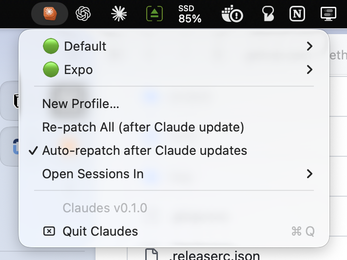

# Claudes

Run multiple isolated Claude accounts on one Mac — work / personal / client —
each with its own dock icon, login, and Claude Code CLI config. A menu bar app
plus two small scripts. Roll-your-own Multi-Claude.

One **profile** = one cloned desktop app (`/Applications/Claude-<Name>.app`,
isolated via `--user-data-dir`) + one CLI config dir (`~/.claude-profiles/<Name>`
via `CLAUDE_CONFIG_DIR`).




## Install

```zsh
curl -fsSL https://raw.githubusercontent.com/sethwebster/claudes/main/install.sh | zsh
```

Builds locally (needs Xcode Command Line Tools — the installer prompts if
missing) and installs Claudes.app. Prefer to read before you pipe?

```zsh
git clone https://github.com/sethwebster/claudes && cd claudes
./install.sh
```

Then click 🤖 in the menu bar → **New Profile…** → e.g. `Work` → sign in once in
the new desktop app, and once in the CLI (`/login`). Add Claudes.app to
System Settings → Login Items to start at boot.

**Shell commands** (added to `~/.zshrc` by install.sh): every profile gets a
CLI command named after it — profile `Work` → `claude-work`, profile `Expo` →
`claude-expo`. Commands appear automatically when profiles are created (a
command-not-found hook covers shells opened before the profile existed) and
never shadow a real binary of the same name. `claude-as <Profile>` is the
explicit, tab-completable form:

```zsh
claude-expo               # Claude Code with the Expo profile
claude-as Expo --resume   # same, explicit form with args
```

For per-project auto-switching, use direnv: `export CLAUDE_CONFIG_DIR=$HOME/.claude-profiles/Work`
in a repo's `.envrc`.

## What the tray does

- Lists profiles with a running indicator (🟢/⚪️)
- Per profile: open the desktop app, open a Claude Code terminal session,
  reveal the data dir, delete the profile
- **New Profile…** — clones and patches Claude.app (progress shown in Terminal)
- **Auto-repatch** — the tray detects when Claude Desktop has updated (version
  drift between the original and each clone) and silently rebuilds idle clones
  in the background. Running instances are picked up on a later check after
  they quit. Menu bar shows 🤖⬆️ while an update is pending, ⏳ while
  rebuilding. Toggle it off in the menu if you prefer manual **Re-patch All**.
  Logins always survive (they live outside the bundle).
- **Self-update** — Claudes checks GitHub releases and offers a one-click
  "Update Claudes to vX.Y.Z" when a newer version ships.

Nothing global is ever switched — each terminal session gets its own
`CLAUDE_CONFIG_DIR`; plain `claude` elsewhere is untouched.

## How the clone works (and why it's shaped this way)

`make-claude-profile.sh`:

1. Copies `Claude.app` → `Claude-<Name>.app`, strips quarantine xattrs.
2. Patches `CFBundleIdentifier` + `CFBundleDisplayName` for a separate identity.
   `CFBundleName` must stay `Claude` — Electron derives the helper-app path from
   it and aborts otherwise.
3. Replaces the main executable with a wrapper that adds
   `--user-data-dir="~/Library/Application Support/Claude-<Name>"`, so isolation
   holds for Finder/Dock launches too.
4. Re-signs only what changed: the main binary ad-hoc with its original
   entitlements (minus team-provisioned ones, plus
   `disable-library-validation` so a team-less binary may load Anthropic's
   team-signed Electron Framework), then the outer bundle seal. Helpers and
   frameworks keep Anthropic's original signatures. Never `codesign --deep` —
   it strips Electron's JIT entitlements and the app crashes at launch.

## Troubleshooting

| Symptom | Fix |
|---|---|
| Clone won't launch after a Claude update | 🤖 → **Re-patch All** |
| "Claudes can't control Terminal" | System Settings → Privacy & Security → Automation → Claudes → enable Terminal |
| Keychain prompt on a clone's first login | Normal (signing identity differs) — click Always Allow |
| `claude` not found in profile terminal | `npm install -g @anthropic-ai/claude-code` |
| Clone crashes at launch (SIGTRAP/dyld) | You may have re-signed it manually with `--deep` — re-patch |

## Releases & contributing

Releases are automated with semantic-release on pushes to `main` — use
[conventional commits](https://www.conventionalcommits.org) (`feat:`, `fix:`,
`BREAKING CHANGE:`) so versions and release notes generate themselves. CI
builds `Claudes.zip`, signs/notarizes when credentials are configured, and
attaches it to the GitHub release; the app's self-update picks it up from
there.

## Disclaimer

Unofficial. Not affiliated with Anthropic. Profile creation clones and re-signs
your locally installed Claude.app for personal use; the clones' built-in
auto-update is intentionally inert (use Re-patch All instead). Use at your own
risk.

## License

MIT
